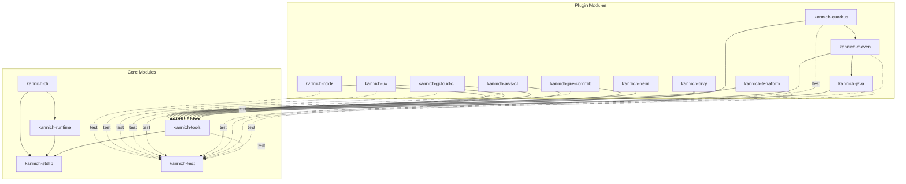

# Kannich Inter-Module Dependencies

## Dependency Graph



Solid arrows = compile/runtime dependency. Dashed arrows = test scope dependency.

## Summary Table

| Module | Depends on (compile) | Depends on (test) |
|---|---|---|
| **kannich-stdlib** | — | — |
| **kannich-test** | — | — |
| **kannich-tools** | kannich-stdlib | kannich-test |
| **kannich-runtime** | kannich-stdlib | — |
| **kannich-cli** | kannich-stdlib, kannich-runtime | — |
| **kannich-java** | kannich-tools | kannich-test |
| **kannich-maven** | kannich-tools, kannich-java | kannich-test |
| **kannich-quarkus** | kannich-tools, kannich-maven | kannich-test |
| **kannich-trivy** | kannich-tools | — |
| **kannich-terraform** | kannich-tools | kannich-test |
| **kannich-pre-commit** | kannich-tools | kannich-test |
| **kannich-helm** | kannich-tools | — |
| **kannich-aws-cli** | kannich-tools | kannich-test |
| **kannich-gcloud-cli** | kannich-tools | kannich-test |
| **kannich-uv** | kannich-tools | kannich-test |
| **kannich-node** | kannich-tools | kannich-test |

## Key Observations

- **kannich-stdlib** is the root: no inter-module dependencies.
- **kannich-tools** is the main hub: all plugins depend on it (and through it, transitively on kannich-stdlib).
- **kannich-runtime** and **kannich-cli** form a separate stack (runtime engine) used only by the CLI, not by plugins.
- **kannich-maven** → **kannich-java** is the only inter-plugin dependency at compile scope.
- **kannich-quarkus** → **kannich-maven** extends that chain one level deeper.
- **kannich-test** has no inter-module dependencies; it is a leaf consumed test-scope by most modules.
- **kannich-trivy** and **kannich-helm** are the only plugins that don't use kannich-test.

## Release Strategy

### The compatibility contract: kannich-stdlib

`kannich-stdlib` is the ABI boundary between the runtime and the plugin ecosystem. The builder image bakes in a specific stdlib version via the CLI fat jar. When a pipeline script loads a plugin via `@file:DependsOn`, that plugin's classes must be binary-compatible with the stdlib already present in the runtime classloader inside the image.

This means **the stdlib version determines plugin compatibility**, not the runtime or CLI version. The builder image tag should advertise the stdlib version it contains (right-hand side), so users know which plugin versions are safe to use against a given image.

### Version tracks

The parent POM should express this as three distinct properties instead of the current single `kannich.core.version`:

- **`kannich.stdlib.version`** — governs `kannich-stdlib` and `kannich-tools`. Stable; expected to change only in exceptional circumstances (significant API additions or breaking changes). When it does change, all plugins must be re-released as they compile against tools/stdlib.
- **`kannich.runtime.version`** — governs `kannich-runtime` and `kannich-cli` only. Never referenced by any plugin. Normal development cadence — bug fixes, new runtime features, security patches.
- **`kannich.test.version`** — governs `kannich-test` only. Expected to change frequently as the test infrastructure is still maturing. Completely independent of the other tracks.

The parent POM's `dependencyManagement` section wires each artifact to the correct property, making it structurally impossible to accidentally pull a mismatched stdlib into a runtime-only change.

> **Note**: how these version properties are actually set and kept in sync across the build (e.g. via Maven versions plugin, manual coordination, or CI tooling) is still to be determined.

### Version bump tooling (wanted)

Manually updating `pom.xml` files across all modules when a version changes is error-prone and tedious. Bump and release are kept as separate steps so the pom.xml changes can be inspected and committed before pulling the trigger on a release.

**Bump executions** — update pom.xml files only, no releasing:

- **`bump-stdlib`** — updates `kannich.stdlib.version` in the parent POM and all affected pom.xml files. This is the nuclear option and should be rare.
- **`bump-runtime`** — updates `kannich.runtime.version` in the parent POM only. No plugin poms need touching.
- **`bump-module`** — updates the version of a single named plugin module in its own pom.xml. Should also handle inter-plugin version references (e.g. `kannich-quarkus` hardcoding the `kannich-maven` version).

**Release executions** — assume pom.xml files are already correct, just publish:

- **`release-runtime`** — releases runtime + CLI + a new builder image only, without touching any plugin or stdlib artifact. Currently missing from the pipeline entirely.
- **`release-module`** — already exists, releases a single named module.
- **`release`** — already exists, full release of everything.

### Release rules

| What changed | Re-release |
|---|---|
| Builder image OS / tooling | image only |
| `kannich-runtime` or `kannich-cli` | runtime + CLI + new image (same stdlib suffix in image tag) |
| `kannich-stdlib` or `kannich-tools` | stdlib + tools + all plugins + runtime + CLI + new image |
| `kannich-test` | kannich-test only |
| A single plugin module | that module only |

### Current gap

Today `kannich.core.version` versions stdlib, tools, runtime, CLI, and test together. A runtime-only change therefore looks identical to a stdlib change and incorrectly implies that all plugins must be re-released. Splitting into `kannich.stdlib.version`, `kannich.runtime.version`, and `kannich.test.version` closes this gap. The module dependency structure already supports the split — only the version properties need updating.

### Individual plugin releases

Any plugin can be released independently as long as it does not require a newer stdlib. The pipeline's `release-module` execution deploys a single module using `-pl`:

```
mvn -B -Prelease deploy -DskipTests -pl kannich-trivy
```

`kannich-builder-image`, `kannich-runtime`, and `kannich-cli` are internal infrastructure and are not published as user-facing Maven artifacts (the pipeline's `update-docs-versions` execution explicitly skips them).

### Builder image versioning

The image tag format `{image-version}-{stdlib-version}` (e.g., `0.9.0-1.0.0`) lets users see at a glance which stdlib a given image contains. A security-patched image with no stdlib change gets a new left-hand version and keeps the same right-hand stdlib version, signalling to users that their existing plugin dependencies remain valid.

### stdlib as a provided dependency

`kotlin-scripting-jvm-host` runs scripts in the same JVM with parent-first classloader delegation, meaning kannich-stdlib baked into the CLI fat jar is already visible to any jars loaded via `@file:DependsOn`. This has two consequences:

**kannich-stdlib should be `provided` scope in kannich-tools.** The runtime owns stdlib; tools only compiles against it. Declaring it `provided` stops the Maven resolver from redundantly downloading and loading stdlib again when kannich-tools is fetched via `@file:DependsOn`.

**Plugins should only ever declare kannich-tools as a compile dependency, never kannich-stdlib directly.** They get stdlib types at compile time transitively (via tools' `provided` dep — the compiler sees it on the classpath regardless of scope), and at runtime via the CLI fat jar. Adding an explicit stdlib dependency in a plugin would be redundant and misleading.

**`@file:DependsOn` for kannich-stdlib is never needed in pipeline scripts.** Since stdlib is baked into the runtime and its types are exposed via kannich-tools, plugin authors only need:

```kotlin
@file:DependsOn("dev.kannich:kannich-tools:x.y.z")
```

The `PipelineBuilder` in `kannich-test` should also drop the stdlib `@file:DependsOn` line it currently generates.

> **Note**: there may be a wrinkle here around how `provided` scope interacts with the Kotlin compiler or the Maven dependency resolver in specific edge cases — to be investigated before implementation.
